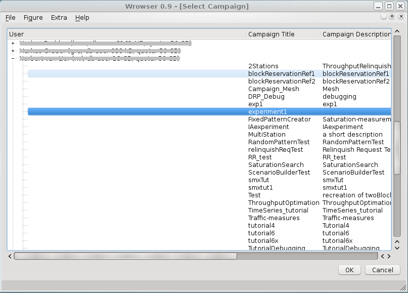

####################################
Experiment 1: Display the throughput
####################################

**************************
Creating a campaign folder
**************************

In this first experiment, you will set up a simple simulation campaign and create a graphical output to evaluate the results. The simulation scenario will consist of two devices (the implementation also uses 'stations' as a synonym) placed next to each other; one station is sending data, the other one receives it.

To set up a simulation campaign, you first need to create a folder where the OpenWNS-sandbox, your simulation settings and your results are stored in. To do this, switch to your OpenWNS-Folder and type

..  code-block:: bash

    $ ./playground.py preparecampaign ../campaigns

This will create a folder with all the data we need to run a simulation. This might take a while, but after some time you are prompted to input serveral things:

#. ``Please enter the name of the directory the simulations shall be
   stored in:``

    This will be the name of your simulation folder. Since you will be simulating experiment 1 in this folder, type ``experiment1``.

#. ``Please enter a name for the campaign:``

    The name of the campaign will be displayed when you are watching the results of the simulation. To keep things simple, just name this campaign ``experiment1``.

#. ``Please enter a short description of the campaign:``

    You can enter a short text here to describe what you are simulating. This gets important when you have lots of simulation results stored and want to identify certain simulations. Type something like ``Tutorial Experiment 1``.

After this, the simulation campaign will be created. When the installation routine has finished, switch into your new simulation folder:

.. code-block:: bash

    $ cd ../campaigns/experiment1

*******************
Simulation settings
*******************

The simulation settings are stored within two python files: ``config.py`` and ``campaignConfiguration.py``. There is already an example file called campainConfiguration.py in the simulation folder, but you will overwrite it now.
For now, just copy the arranged settings into your simulation folder:

.. code-block:: bash

    $ cp ../../myOpenWNS/tests/system/wimemac-Tests--main--1.0/PyConfig/experiment1/config.py .
    $ cp ../../myOpenWNS/tests/system/wimemac-Tests--main--1.0/PyConfig/experiment1/campaignConfiguration.py .

Once the settings are copied, the simulation is ready to use. But first, let's have a closer look at the setting-files:

config.py
---------

Open the file ``config.py`` with a text editor. At the beginning of this file, many other codeblocks are imported. Let's take a closer look at this line:

.. code-block:: python

    from openwns.wrowser.simdb.SimConfig import params

This line imports the structure 'params' from the simulation configuration. We will see later, that this structure is created in campaignConfiguration.py. The following code sets up some variables:

.. literalinclude:: ../../../../../.createManualsWorkingDir/wimemac.tutorial.experiment1.config.simulationParameter
   :language: python

As you can see, the parameters ``maxSimTime`` and ``throughputPerStation`` are initialized with values from the imported structure 'params'. Let's see what this structure contains. Open the file ``campaignConfiguration.py`` with a text editor.

campaignConfiguration.py
------------------------

In this file, the parameter class 'params' is instantiated

.. literalinclude:: ../../../../../.createManualsWorkingDir/wimemac.tutorial.experiment1.campaignConfiguration.Set
   :language: python

and also initialized:

.. literalinclude:: ../../../../../.createManualsWorkingDir/wimemac.tutorial.experiment1.campaignConfiguration.initialization
   :language: python

So the structure 'params' contains the float ``simTime`` and the integer ``throughputPerStation`` and their values. As you can see, the value for ``throughputPerStation`` is placed in a for-loop. This is to create a simulation campaign with more than one simulation scenario. Everytime the line ``params.write()`` is passed, the current values of ``params`` are exported into the database and a simulation is created. Your campaign consists of 10 simulation scenarios; each scenario has a simulation time of 10 seconds and each one has a different value for ``throughputPerStation``, which corresponds to a downlink traffic from 10 Mb/s to 100 Mb/s.

**************************************
Preparing And Executing The Simulation
**************************************

simcontrol.py
-------------

To start the simulation, use the script 'simcontrol.py', which is in your simulation folder by default. With the command

.. code-block:: bash

   $ ./simcontrol.py --create-database

the ``campaignConfiguration.py`` is executed and a database is created that is needed for this campaign. Afterwards, type

.. code-block:: bash

  $ ./simcontrol.py --create-scenarios

This command reads the database and creates a folder for each simulation inside our campaign folder. Each created folder has a number as its name. The successful creation of the scenarios can be validated by typing 

.. code-block:: bash

   $ ./simcontrol.py -i

This should lead to a text output like this:

.. code-block:: bash

     id    state        [...]       simTime  throughputPerStation
      1    NotQueued                 10.0         10000000
      2    NotQueued                 10.0         20000000
      3    NotQueued                 10.0         30000000
      4    NotQueued                 10.0         40000000
      5    NotQueued                 10.0         50000000
      6    NotQueued                 10.0         60000000
      7    NotQueued                 10.0         70000000
      8    NotQueued                 10.0         80000000
      9    NotQueued                 10.0         90000000
     10    NotQueued                 10.0         100000000

Now you can check if your simulation starts properly if you execute it. To do that, switch into one of the new created scenario folders and start the simulation using the debug mode by typing

.. code-block:: bash

   $ ./openwns-dbg

If everything is correct, you should see now the debug output of the simulation. You can see the simulation time at the left side of the output. When it reaches 10 seconds (according to the parameter ``simTime``), the simulation will be finished and ends itself. Since this might take a while, you can abort the debug mode (press Ctrl+C) and switch to the simulation campaign folder of your experiment again.
To start the simulation, type

.. code-block:: bash

   $ ./simcontrol --execute-locally --restrict-state=NotQueued

Now, the simulation is running:

.. code-block:: bash

   Executing scenario with id: 1
   Executing scenario with id: 2
   Executing scenario with id: 3
   Executing scenario with id: 4
   Executing scenario with id: 5
   Executing scenario with id: 6
   Executing scenario with id: 7
   Executing scenario with id: 8
   Executing scenario with id: 9
   Executing scenario with id: 10

After some time, the scenario should be finished and the simulation will terminate itself. The successful accomplishment of the simulation can be controlled again:

.. code-block:: bash

    $ ./simcontrol.py -i
        id    state  [...]  simTime prog   sgeId  host  simTime     throughputPerStation
        1   Finished         5.00s  100.00%               10.0          10000000
        2   Finished         5.00s  100.00%               10.0          20000000
        3   Finished         5.00s  100.00%               10.0          30000000
        4   Finished         5.00s  100.00%               10.0          40000000
        5   Finished         5.00s  100.00%               10.0          50000000
        6   Finished         5.00s  100.00%               10.0          60000000
        7   Finished         5.00s  100.00%               10.0          70000000
        8   Finished         5.00s  100.00%               10.0          80000000
        9   Finished         5.00s  100.00%               10.0          90000000
       10   Finished         5.00s  100.00%               10.0          100000000

Each scenario directory contains now a folder called 'output', which contains the simulation results. But reading the results in a text is quite uncomfortable, so the results are also stored in the campaign database, where they can be accessed by a more user friendly programm to display the results.

********************
Evaluate The Results
********************

Wrowser
-------

The Wrowser (``Wireless network simulator result browser'') is a program to plot the simulation results in a clear and convenient way. For the following part of this tutorial, it is necessary that the Wrowser is installed. Start the Wrowser.

To display your simulation results, select ``File-> Open Campaign Database``. Under the appropriate user name (e.g. your user name), the campaign name and its description is displayed. Select your campaign.

On the left side of the Wrowser window, the simulation parameters are listed. Do not uncheck any of them as you are going to display the results. Select ``Figure-> New-> Parameter``. A new window opens; maximize it to get a better view at the buttons.

In this window, select 'throughputPerStation' as the simulation parameter. This will be displayed in the X-Axis. To select the Y-Axis parameter, click on the 'Y-Axis'-Tab and select ``wimemac.traffic.incoming.throughput_wns.node.Node.id_X_Moments``. X must be replaced with the ID of the receiving station. This probe shows the incoming data throughput of the receiving node, which is the amount of data that has reached its destination. In this scenario, the receiving station is the one with the higher ID. Now, select ``Draw``. If everything went fine, the graph looks like this:

As you can see, the more traffic is offered by the sending station, the higher is the data throughput. In every scenario the throughput is nearly as high as the offered load so the transmission was successful in all simulations.

In the following experiment you will see what the most common reason is if not all the data could be transferred.