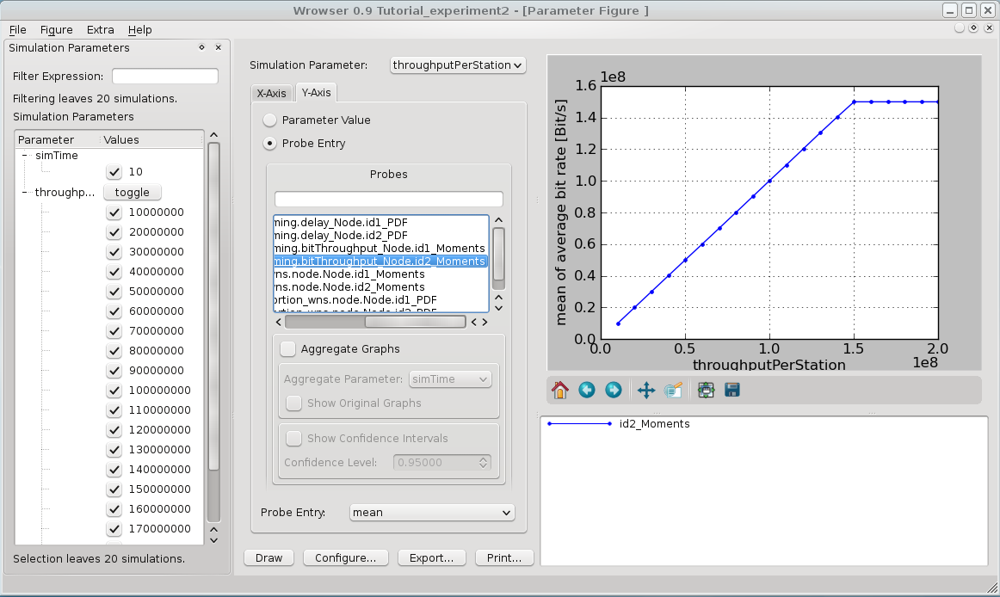
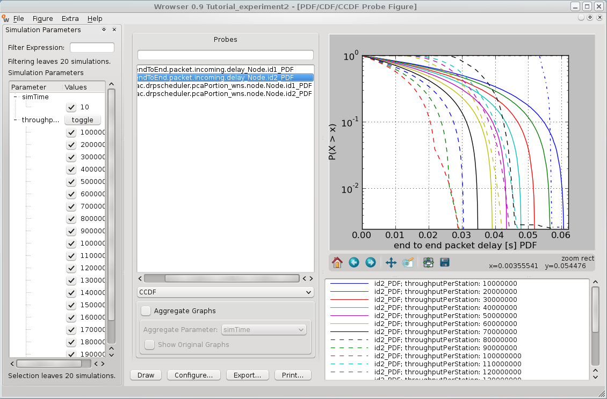

########################################
Experiment 2: Saturation And Packet Delay
########################################

.. note::

    The simulation campaign from experiment 1 is reused for this experiment. It is not neccessary to create a new subcampaign yet.

In this experiment you will edit the configuration of experiment 1, measure the maximum throughput between the stations and display 2 different aspects of the simulation results.

*************************************
Changing the simulation configuration
*************************************

Switch to your campaign folder ``campaigns/experiment1`` and open the file ``campaignConfiguration.py``. Enhance the number of simulation scenarios from 10 to 20. The parameter ``throughputPerStation`` has currently a range from 10 Mb/s to 100 Mb/s. Change the for-loop to this:

.. literalinclude:: ../../../../../.createManualsWorkingDir/wimemac.tutorial.experiment2.campaignConfiguration.initialization
   :language: python

The campaign now consists of 20 scenarios, the data throughput in the last scenario is 200 Mb/s.
These changes won't take effect unless the contents of the campaignConfiguration.py are written into your campaign database. So you need to execute

.. code-block:: bash

   $ ./simcontrol.py --create-database

and

.. code-block:: bash

  $ ./simcontrol.py --create-scenarios

again. When you create the scenarios, you can see that the already existing scenarios are omitted. Only the 10 new scenario folders are created.
Now your campaign is ready to run.

.. code-block:: bash

    $ ./simcontrol --execute-locally-with-state=NotQueued
    Executing scenario with id: 11
    Executing scenario with id: 12
    Executing scenario with id: 13
    Executing scenario with id: 14
    Executing scenario with id: 15
    Executing scenario with id: 16
    Executing scenario with id: 17
    Executing scenario with id: 18
    Executing scenario with id: 19
    Executing scenario with id: 20

********************
Evaluate The Results
********************

Throughput
----------

Start the Wrowser and select your campaign. Select the same graph configuration as in experiment 1 to display the data throughput over the offered load. Now you should see a graph like this:

The graph from experiment 1 is extended by 10 new measurement points. As you can see, all the data can be transmitted without problems unless the offered load is higher than 160 Mb/s. The amount of successfully transferred data stays the same for higher values of ``throughputPerStation``. This means that 160 Mb/s is the saturaion point of the system.

Frame Delay
------------

Another interesting aspect besides the saturation point is the frame delay. The frame delay is the time between the generation of a data frame and its successful reception. It is an indicator for how long the frame had to be queued before it could be transmitted. To display this delay with the Wrowser, first select ``Figure-> New-> PDF/CDF/CCDF``. Select ``traffic.endToEnd.packet.incoming.delay_wns.node.Node.id_X_PDF`` (where X is the ID of the receiving node) from the probe list and select ``CCDF`` from the drop-down list below the probe list. Now click the ``Configure...`` button and set the Y-Axis to a logarithmic scale (lg). After clicking ``OK`` and ``Draw`` you should see a graph which has only some curves at the left edge.

To get a better view at the curves, zoom into the left part of the graph by clicking on the ``zoom to rectangle`` button below the graph and mark the left part of the diagram. Now you have a better view on the interesting part of the graph:

With the arrow buttons next to the zoom button, you can switch between your current view and your previous views. The X-Axis shows the frame delay in seconds, while the Y-Axis shows the propability that the delay is higher than the X-value. Every curve in this diagram represents a simulation with a specific value for ``throughputPerStation``. The frame delay goes up to 0.06 seconds in some scenarios. It is also noticable that the delay is smaller the higher the value of ``throughputPerStation`` is (exept for the oversaturated transmissions). This appearance is further analyzed and explained in experiment 3.

In the following experiment you will see how to alter the delay and the saturation point by using different reservation strategies.
