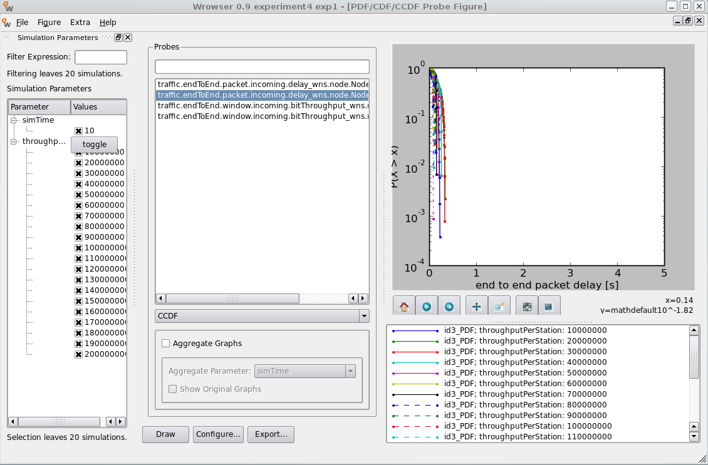

########################################
Experiment 2: Saturaion And Packet Delay
########################################

.. note::

    We will re-use the simulation campaign from experiment 1 for this experiment. It is not neccessary to create a new subcampaign yet.

In this experiment we will edit the configuration of experiment 1, measure the maximum throughput between the stations and display 2 different aspects of the simulation results.

*************************************
Changing the simulation configuration
*************************************

Switch to your campaign folder ``campaigns/experiment1`` and open the file ``campaignConfiguration.py``. We will enhance the number of simulation scenarios from 10 to 20. The parameter ``throughputPerStation`` has currently a range from 10 Mb/s to 100 Mb/s. Change the for-loop to this:

.. literalinclude:: ../../../../../.createManualsWorkingDir/wimemac.tutorial.experiment2.campaignConfiguration.initialization
   :language: python

Save it afterwards. The campaign consists now of 20 scenarios, the data troughput in the last scenario is 200 Mb/s.
These changes won't take effect unless the contents of the campaignConfiguration.py are written into our campaign database. So we need to execute 

.. code-block:: bash

   $ ./simcontrol.py --create-database

and

.. code-block:: bash

  $ ./simcontrol.py --create-scenarios

again. When you create the scenarios, you can see that the already existing scenarios are omitted. Only the 10 new scenario folders are created.
Now our campaign is ready to run.

.. code-block:: bash

    $ ./simcontrol --execute-locally-with-state=NotQueued
    Executing scenario with id: 11
    Executing scenario with id: 12
    Executing scenario with id: 13
    Executing scenario with id: 14
    Executing scenario with id: 15
    Executing scenario with id: 16
    Executing scenario with id: 17
    Executing scenario with id: 18
    Executing scenario with id: 19
    Executing scenario with id: 20

********************
Evaluate The Results
********************

Throughput
----------

Start the Wrowser and select your campaign. Select the same graph configuration as in experiment 1 to display the data throughput over the offered load. Now you should be seeing a graph like this:

.. figure:: images/experiment2-Wrowser_throughput.png
   :align: center

The graph from experiment 1 is extended by 10 new measurement points. As you can see, all the data can be transmitted without problems unless the offered load is bigger than 160 Mb/s. The amount of successfully transferred data stays the same for higher values of ``throughputPerStation``. This means that 160 Mb/s is the saturaion point for the data throughput. If the offered load is higher than the saturation point of the transmission, not all the data can be transferred.

Packet Delay
------------

Another interesting aspect besides the saturation point is the packet delay. The packet delay is the delay between the generation of a data packet in the sending station and the transmission of this packet. There is a way to display this delay with the Wrowser: First, select ``Figure-> New-> PDF/CDF/CCDF``. Select ``traffic.endToEnd.packet.incoming.delay_wns.node.Node.id3_PDF`` from the probe list and select CCDF on the butten below the probe list. Now click the ``Configure...`` button and set the Y-Axis to a logarithmic scale (ln). After clicking ``OK`` and ``Draw`` you should see a graph like this:

We can hardly get any information out of this view, so zoom to the left part of the graph by clicking on the ``zoom to rectangle`` button below the graph and mark the left part of the diagram. Now we have a better view on the interesting part of the graph:

.. figure:: images/experiment2-Wrowser_delayZoomed.png
   :align: center

The X-Axis shows the packet delay in seconds, while the Y-Axis shows the propability that the delay is bigger than the X-value. Every scenario has its own curve in this diagram. The packet delay goes up to 0.3 seconds in some scenarios. It is also noticable that the delay is smaller the higher the value of ``throughputPerStation`` is.

In the following experiment we will see how we can manipulate the delay and the saturation point.
