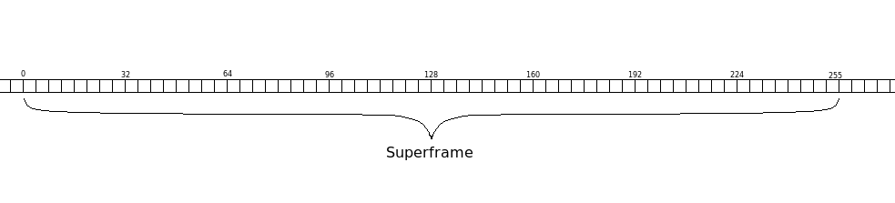
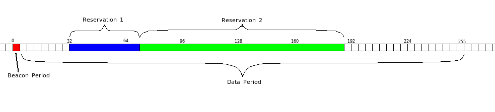
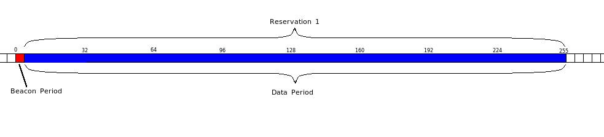
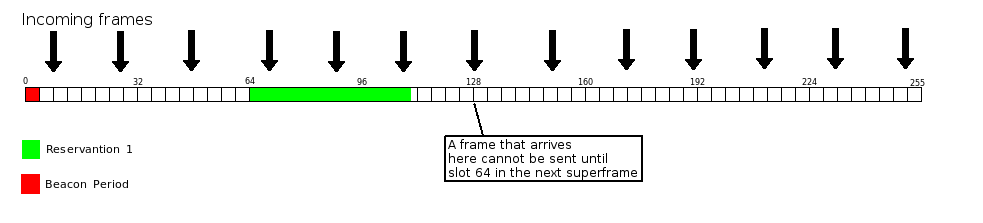
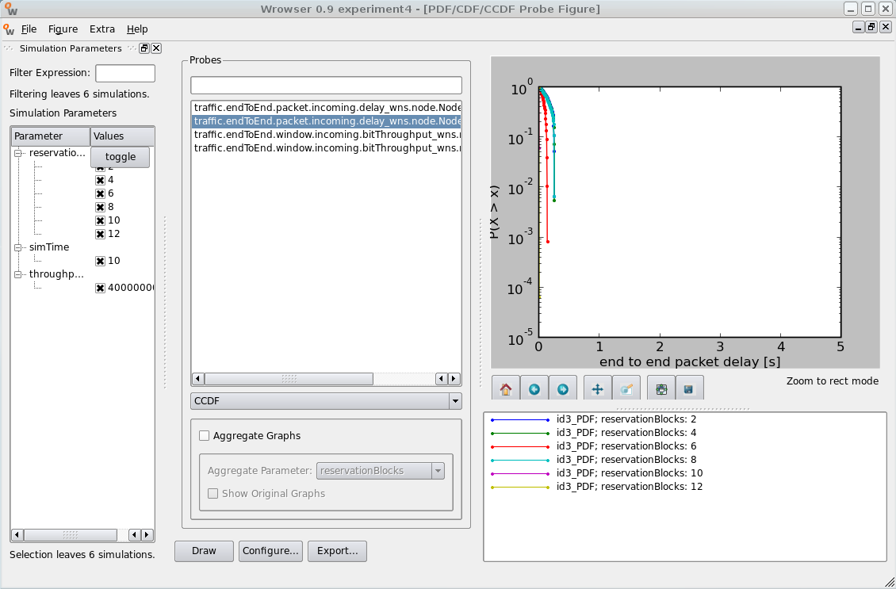
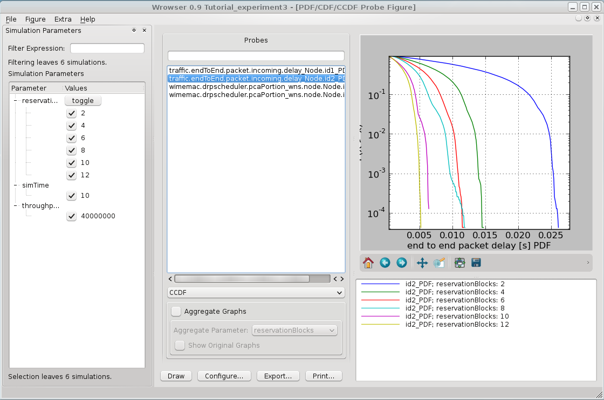

#####################################
Experiment 3: Reservation Negotiation
#####################################

The purpose of this experiment is to give an introduction to the communication between the stations and to explain how a transmission is negotiated.
Before we can start the next experiment, we need to know how a transmission between two stations is established. Therefore the following section contains some basic knowledge of the WiMedia standard.

************************
Transmission Negotiation
************************

Frames and Slots
----------------

Every station divides time in time slots. Every time slot has a length of 0.065 ms. 256 time slots form one superframe. The slots in a superframe are numbered from 0 to 255. Before a station starts to transmit data, it reserves time slots. Afterwards, it informs every reachable other station in which slots it is going to send. This is done to avoid signal interference if two stations want to send data at the same time. 

The first few time slots of each superframe are called 'beacon period'. Within these slots, every station sends signals to all reachable stations to inform them about existing or upcoming transmissions. The remaining slots are called the 'data period'. Reservations for transmissions are only allowed within the data period. Once the time slots are reserved, the station sends data in these slots in every superframe until the transmission is complete. If another station wants to start a transmission now, it will reserve other slots so that the two transmissions do not interfere with each other.

The more traffic a station produces (i.e. the higher the value for ``throughputPerStation`` is), the more slots are reserved by this station. Once the produced traffic is high enough, all 256 slots are reserved. 

If the traffic raises further, not all of the data can be transferred since the maximum capacity of the transmission is reached. This is called 'saturation' (compare to the results of experiment 2).

Reservation Patterns
--------------------

The slot reservations in the pictures above have one thing in common: All the reservations consist of one block of contiguous slots. Every reservation block has a short time at its end (0.012 ms, ca. 18% of the last slot) where it stops the transmission. This short time is called 'guard time'. The guard time ensures that different reservations won't overlap and that one transmission clearly stops before another transmission begins.
To place the reservation into one block has advantages and disadvantages. The greatest advantage of a contiguous slot reservation is to reduce the amount of unused transmission time. Unused transmission time occurs because the transmitted data is put together to 'packets' (also called 'compounds'). Every reservation block can only contain an integer number of compounds, so there is a small unused offcut at the end of each block which is too small to contain another compound. If the reservation is fragmented to many blocks, there are a lot of offcuts in the superframe caused by spaces that are smaller than one compound and by the guard time. This leads to a lower saturation point since less data can be transferred.
But using one reservation block has also a disadvantage: Since the packets arrive at the transmitter of the sending station in nearly equal time spaces (look at following picture), some of the data packets have to be buffered for almost one superframe, before they can be transmitted.

That leads to an increased packet delay that is disadvantageus for fast transmissions.

*****************************
Manipulating The Packet Delay
*****************************

For this experiment we will create a new subcampaign within our campaign folder. First, switch to your OpenWNS directory. Type

..  code-block:: bash

    $ ./playground.py preparecampaign ../campaigns

This is the same command as for creating a new campaign. After some time the script will prompt you that the campaign folder already exists.

.. code-block:: bash

    Shall I try to (U)pdate the sandbox or do you want to (C)reate a new sub campaign? Type 'e' to exit (u/c/e) [e]:

Create a new subcampaign and choose ``experiment3`` as the folder name. After choosing a name and a description, the subcampaign is created. Since the simulations in this experiment are similar to the one before, we copy the config.py and the campaignConfiguration.py from our previous campaign folder to our new subcampaign directory.

In this experiment we will determine the effect of the number of reservation blocks on the packet delay. First, open campaignConfiguration.py; extend the parameter set 'params' by one new parameter ``reservationBlocks`` (Integer). Then set the variable ``throughputPerStation`` to a fixet value (40E6) and include ``reservationBlocks`` in the for-loop like this:

.. literalinclude:: ../../../../../.createManualsWorkingDir/wimemac.tutorial.experiment3.campaignConfiguration.initialization
   :language: python

Afterwards, we need to apply our new parameter to the config.py file. Open the file and look for this line

.. code-block:: python

        reservationBlocks = 1

and change the value to the corresponding variable of ``params``. Now our changes on the config files alre complete. You can also find a copy of the already changed files in

.. code-block:: bash

    $ cd ../../myOpenWNS/tests/system/wimemac-Tests--main--1.0/PyConfig/experiment3/config.py
    $ cd ../../myOpenWNS/tests/system/wimemac-Tests--main--1.0/PyConfig/experiment3/campaignConfiguration.py

Create the database, the scenarios and start the simulation campaign. When all of the 6 simulations are complete, open the Wrowser and select our new subcampaign. We want to display the packet delay, so do the same as in experiment 2: Select ``Figure-> New-> PDF/CDF/CCDF``, mark the ``traffic.endToEnd.packet.incoming.delay_wns.node.Node.id3_PDF`` probe and switch the box under the probes to CCDF. Don't forget to set the Y-Axis to a logarithmic scale (lg) via the ``Configure...`` button. If everything went right, the graph should look like this:

and if we zoom in a little by using the 'Zoom to rectangle' button:

This figure shows that a higher number of reservation blocks leads to a smaller packet delay. The reason why we don't split up our reservation to many small reservation blocks is the saturation point. As mentioned before, at the end of every reservation block is a short unused space caused by the guard time and the offcuts. If we had two parallel transmissions and each of them would be split up to many reservation blocks, the superframe would look like this:

.. figure:: images/experiment3-Superframe_GuardTime.png
   :align: center

Since a significant part of the superframe is occupied by unused time, there is less time in each frame for the actual transmission. The optimal solution for this problem is a mixture between a one-block-reservation and the multiple split up. For further experiments, we will set the parameter ``reservationBlocks`` to 2.

In the next experiment, we will learn about signal interference and the hidden-node-problem.