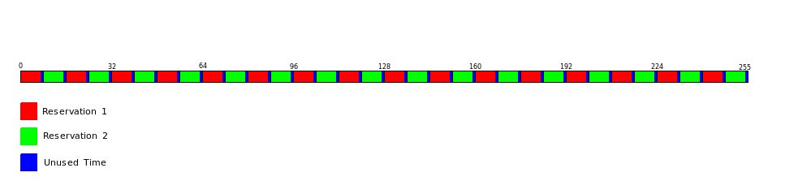

#####################################
Experiment 3: Reservation Negotiation
#####################################

The purpose of this experiment is to give an introduction to the communication between the stations.
Before we can start the next experiment, we need to know how a channel between two stations is established. Therefore the following section contains some basic knowledge of the WiMedia standard.

************************
Transmission Negotiation
************************

Frames and Slots
----------------

Every station divides time into slots, called MASs (medium access slots). Every MAS has a length of 0.256 ms. 256 MAS form one superframe. The slots in a superframe are numbered from 0 to 255. The WiMeMAC module uses the Distributed Reservation Protocol (DRP) to initiate and maintain transmissions: Before a station starts to transmit data, it reserves time slots. Afterwards, it broadcasts to every reachable other station in which slots it is going to send. This is done to avoid interference if two stations want to send data at the same time.

.. figure:: images/experiment3-Superframe_blank.png
   :align: center

The first few MASs of each superframe are reserved to transmit beacons. Beacons are messages that inform all neighbours of a station (i.e. all other stations within the transmission range) about existing or upcoming MAS reservations. The time reserved for beacons is called the 'beacon period'. The remaining time of the superframe is called the `data transfer period'. User data transmissions are only allowed within the data period. Once the MASs are reserved, the station sends data in these MASs in every superframe until all user data is transferred. If another station wants to start a transmission now, it will reserve other MASs so that the two transmissions do not interfere with each other.

The more load per station is offered (i.e. the higher the value for ``throughputPerStation`` is), the more MASs are reserved by this station. If a station offers a lot of load per second, this station might reserve the whole superframe to transmit its data as fast as possible. 

.. figure:: images/experiment3-Superframe_full.png
   :align: center

If the offered load increases further, not all of the data can be transferred since the maximum capacity of the system is reached. This is called `saturation' (compare to the results of experiment 2).

Reservation Patterns
--------------------

The MAS reservations in the pictures above have one thing in common: All the reservations consist of adjacent reserved MASs, forming an reservation block. In each reservation block a guard time of 0.012 ms at the end of the block is needed where no data is transferred. The guard time ensures that different reservations won't overlap and that one transmission clearly stops before another transmission begins.
To place the reservation into one block has advantages and disadvantages. The greatest advantage of a contiguous MAS reservation is to reduce the amount of unused transmission time. Unused transmission time occurs because the transmitted data is put together to `frames' (also called `compounds'). Every reservation block can only contain an integer number of compounds, so there is a small unused offcut at the end of each block which is too small to contain another compound. If the reservation is split to many reservation blocks, channel time is wasted in the superframe caused by spaces that are smaller than one compound and by the guard time. This leads to a lower system capacity since less data can be transferred.
But using one reservation block has also a disadvantage: Since the frames arrive at the transmitter of the sending station before as well as after the reservation block (look at following picture), some of the data frames have to be buffered for almost one superframe, before they can be transmitted.

.. figure:: images/experiment3-Superframe_delay.png
   :align: center

That leads to an increased frame delay that is disadvantageus for fast transmissions.

*****************************
Manipulating The Packet Delay
*****************************

For this experiment we will create a new subcampaign within our campaign folder. First, switch to your OpenWNS directory. Type

..  code-block:: bash

    $ ./playground.py preparecampaign ../campaigns

This is the same command as for creating a new campaign. After some time the script will prompt you that the campaign folder already exists.

.. code-block:: bash

    Shall I try to (U)pdate the sandbox or do you want to (C)reate a new sub campaign? Type 'e' to exit (u/c/e) [e]:

Create a new subcampaign and choose ``experiment3`` as the folder name. After choosing a name and a description, the subcampaign is created. Since the simulations in this experiment are similar to the one before, we copy the config.py and the campaignConfiguration.py from our previous campaign folder to our new subcampaign directory.

In this experiment we will determine the effect of the number of reservation blocks on the frame delay. First, open campaignConfiguration.py; extend the parameter set `params' by one new parameter ``reservationBlocks`` (Integer). Then set the variable ``throughputPerStation`` to a fixed value (40E6) and include ``reservationBlocks`` in the for-loop like this:

.. literalinclude:: ../../../../../.createManualsWorkingDir/wimemac.tutorial.experiment3.campaignConfiguration.initialization
   :language: python

Afterwards, we need to apply our new parameter to the config.py file. Open the file and look for this line

.. code-block:: python

        reservationBlocks = 1

and change the value to the corresponding variable of ``params``. Now our changes on the config files are already completed. You can also find a copy of the already changed files in

.. code-block:: bash

    $ cd ../../myOpenWNS/tests/system/wimemac-Tests--main--1.0/PyConfig/experiment3/config.py
    $ cd ../../myOpenWNS/tests/system/wimemac-Tests--main--1.0/PyConfig/experiment3/campaignConfiguration.py

Create the database, the scenarios and start the simulation campaign. When all of the 6 simulations are completed, open the Wrowser and select our new subcampaign. We want to display the frame delay, so do the same as in experiment 2: Select ``Figure-> New-> PDF/CDF/CCDF``, mark the ``traffic.endToEnd.packet.incoming.delay\_wns.node.Node.id3\_PDF`` probe and switch the box under the probes to CCDF. Don't forget to set the Y-Axis to a logarithmic scale (lg) via the ``Configure...`` button. If everything went right, the graph should look like this:

.. figure:: images/experiment3-Wrowser_delayNotZoomed.png
   :align: center

and if we zoom in a little by using the 'Zoom to rectangle' button:

.. figure:: images/experiment3-Wrowser_delayZoomed.png
   :align: center

This figure shows that a higher number of reservation blocks leads to a smaller frame delay. The reason why we don't split up our reservation to many small reservation blocks is the low system capacity. As mentioned before, in every reservation block channel time is wasted. If there are two parallel transmissions and each of them is split up to many reservation blocks, the superframe would look like this:

Since a significant amount of resources are unused, there is less time in each superframe for the transmission of user data. The optimal solution for this problem is a compromise between a one-block-reservation and the multiple split up. Splitting the reservation up into 2 blocks yields a frame delay small enough for our needs and doesn't cause much unused channel time. For further experiments, we will set the parameter ``reservationBlocks`` to 2.

In the next experiment, we will learn about signal interference and the hidden-node-problem.