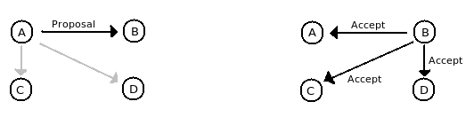
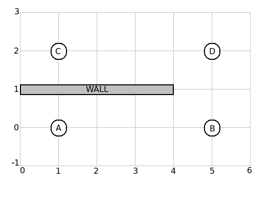
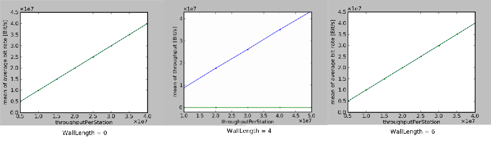
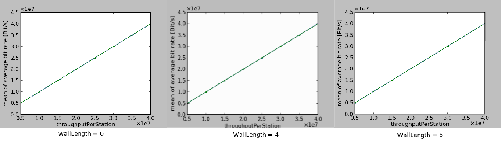

#################################
Experiment 4: Hidden Node Problem
#################################

In this experiment we will demonstrate a problem that may occur when not all the stations in the scenario are in transmission range to each other, the so called `hidden node problem'.

*****************
The Beacon Period
*****************

Every station gathers information on MAS reservation. In the WiMeMAC module of the openWNS, this information is stored in a DRP-Map (DRP = Distributed Reservation Protocol), an array of 256 boolean variables. If one of these variables is set to ``true``, the corresponding MAS is occupied; a ``false``- statement marks a MAS as unoccupied. If one station wants to reserve MASs, it checks its own DRP-Map and chooses only the free MASs for its reservation. Within the following beacon period, the station (which is the reservation owner, i.e. the sending device, since it initializes the reservation) sends its reservation proposal to the reservation target. The target compares the proposal to its DRP-Map and if none of the proposed MASs are occupied, the target accepts the proposed MASs and sends a DRPIE (DRPInformation Element) in the next beacon period. A DRPIE is an additional information that can be sent within a beacon. It may contain amongst other things the acceptance or the denial of a reservation proposal, or a proposal itself; DRPIEs concerning proposals contain also a DRP-Map with the proposed MAS reservation.

Every station that receives a DRPIE containing a proposal acceptance, updates its own DRP-Map and considers the proposed MASs as occupied. When the reservation owner receives the DRPIE, it starts transmitting data in the upcoming data transfer period. As long as the transmission is running, the transmission target and the owner will send a DRPIE in every beacon period so that all neighbours defer frame channel access within the occupied MASs.

**************************
Assembly Of The experiment
**************************

We will use 4 Stations in this experiment instead of 2. Additionally we will place a wall between these stations that attenuates signals. The scenario will look like this:

The wall attenuates each trespassing signal by 100 dB which means it blocks signals quite completely. It starts at point (0, 1) in this scenario; one unit in our scenario coordinate system represents one meter. The transmission range is influenced by a varying wall length:

#. If the wall length is shorter than 1 meter, all stations are in transmission range.

#. For a wall length between 1 and 3 meters, a transmission between station A and station C is impossible. Every other transmission is still possible.

#. If the wall-length is between 3 and 5 meters, only station B is in the transmisison range of A; station C can only recieve signals from D. B and D are still in each others transmission range.

#. The last case is that the wall separates A and B from C and D completely. This happens for a wall-length longer than 5 meters.

In this scenario, station A will initiate a transmission to B at the beginning of the simulation time. After one second, station C will try to establish a connection to D. We will determine the success of the transmissions by displaying the throughput of each connection with the Wrowser.
Create a new subcampaign called ``experiment4`` and copy the config.py and the campaignConfiguration.py from experiment 2 into the campaign folder. To create the scenario with 4 stations and a wall, we need to do various changes to our config files.

campaignConfiguration.py
------------------------

In this experiment we will simulate the described scenario for a varying length of the wall. At first, add a new parameter to ``params`` called `wallLength' (data type: ``Float``). Initialize this variable with the value ``0.0``. Since we start several simulation campaigns in this experiment, you might want to set the simulation time to 5 seconds and reduce the number of scenarios per campaign by changing the numbers in the for-loop to shorten the duration of one campaign execution.

.. literalinclude:: ../../../../../.createManualsWorkingDir/wimemac.tutorial.experiment4.campaignConfiguration.Set
   :language: python

Everithing else, including the placement of the stations and the wall, is configured in the config.py.

config.py
---------

Between the parameters ``maxSimTime`` and ``throughputPerStation`` is a parameter ``numberOfStations`` that indicates the number of stations in this scenario. Set it to 4. Now we will arrange these 4 stations according to our scenario assembly in the picture above. Scroll down to these lines:

.. literalinclude:: ../../../../../.createManualsWorkingDir/wimemac.tutorial.experiment4.config.StaSetup
   :language: python

This is where the stations are instantiated and placed into a three-dimensional coordinate system. The line ``position = openwns.geometry.Position(xCoord, configuration.sizeY / 2 ,0),`` contains the coordinates. This configuration would lead to a scenario where all the stations are arranged in a straight line; the x-coordinate ranges from 0 to 3, the y-coordinate is 5 and z is 0.
Change the instantiation of the stations so that the 4 stations are at the right positions corresponding to the picture of the scenario. The z-coordinate is always 0; the x- and y-coordinates for the 4 stations are (1,0), (5,0), (1,2) and (5,2).

Now we need to configure the properties of the stations. Scroll to these lines:

.. literalinclude:: ../../../../../.createManualsWorkingDir/wimemac.tutorial.experiment4.config.StaTraffic
   :language: python

The variable cbr contains the time when a station starts a transmission, ipBinding contains the owner and the target of the transmission and the last line, ``WNS.simulationModel.nodes[1].load.addTraffic(ipBinding, cbr)`` contains the transmission owner and uses the other two variables to start the transmission. As you can see, in our previous experiments a transmission from station 1 to station 2 is established at 0.01 seconds of simulation time. A transmission starting at 0.00 seconds would lead to unexpected behaviour.
Create a second transmission from station 3 to station 4, starting at 1.01 seconds of simulation time.

If you have any problems with the configuration, or the experiments results are not as they should be, you can find a copy of the correctly configured versions for this experiment at

.. code-block:: bash

    $ cd ../../myOpenWNS/tests/system/wimemac-Tests--main--1.0/PyConfig/experiment4/config.py
    $ cd ../../myOpenWNS/tests/system/wimemac-Tests--main--1.0/PyConfig/experiment4/campaignConfiguration.py

We still have to place the wall between the stations. Look for the line

.. code-block:: python

    objs = []
    ## e.g. single wall
    #objs.append(rise.scenario.Shadowing.LineSegment(openwns.geometry.Position(0.0, 1.0, 0.0),
    #                                            openwns.geometry.Position(wallLength , 1.0, 0.0), 
    #                                            attenuation = dB(100) ))

and replace it with these:

.. literalinclude:: ../../../../../.createManualsWorkingDir/wimemac.tutorial.experiment4.config.Wall
   :language: python

That's it. The parameter ``wallLength`` from campaignConfiguration.py is used to create a wall from (0,1) to (wallLength,1). Now our simulation setup is complete.

**********************
Evaluate The Results
**********************

From what we know about transmissions and beacons, we're able to predict the outcome of this experiment. For different values of ``wallLength`` we should recieve different outcomes:

#. wallLength = 0: All stations can receive the beacons of all other stations. At first, station 1 sends a proposal for MAS reservation. Station 3 and 4 ignore this proposal since station 2 is the reservation target and the target address is sent within the DRPIE. Station 2 accepts the proposal and sends an DRPIE containing an acception in its next beacon. Every other station recieves this DRPIE and marks the reserved MAS as occupied in their DRP-Map. After the connection between 1 and 2 is established, station 3 creates a proposal considering the already occupied MASs. Then, station 4 accepts the proposal; both connections are established.

#. wallLength = 4: This is where it should go wrong. After station 1 sendt the proposal to station 2, 2 sends the accepting DRPIE that only reaches station 1 and 4. These stations update their DRP-Map. Station 3 doesn't update its DRP-Map because the accepting DRPIE was blocked by the wall. After station 1 and 2 have set up a connection, station 3 creates a new proposal while its DRP-Map still consists of unoccupied MASs. When station 4 receives this proposal, it won't accept it since it knows about the reserved MASs from station 2. Station 3 can't find out which MASs are reserved so a connection can not be established.

#. wallLength = 6: The stations 1 and 2 are completely separated from stations 3 and 4. The connections can both be created separately.

With these considerations, the experiment results might look like this: 

The inability to transmit data because the owner and the targed have different information about their environment is called the ``Hidden Node Problem''.
Start the simulation and display the results with the wrowser. Afterwards, change the value for wallLength to 4, then to 6. Compare the throughput of both connections for the different values of wallLength. If everything went well, the results will differ from what we expected:

Although station 3 cannot communicate with station 1 or 2 for a wall length of 4, it can establish a working connection to station 4. The WiMedia standard includes an algorithm to avoid the hidden-node-problem: If a connection is rejected due to reserved MASs within the proposed reservation pattern, the reservation target sends back a so called ``availability map''. This map contains all the free MASs of the reservation target.
So when station 3 sends a proposal with MASs that are already reserved by station 1, station 4 realizes the conflict and sends an availability map with all free MASs back to station 3. Now station 3 can create a new reservation pattern by using only the MASs that are marked free within the availability map. Thus a connection between 3 and 4 can be established.

In the next experiment, we will discuss the rivalry between connections concerning MASs and how reservation patterns of several connections can be adapted using a `relinquish request'.