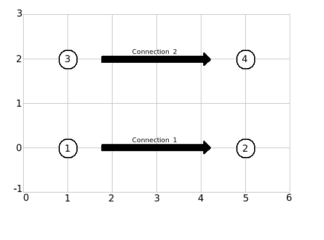
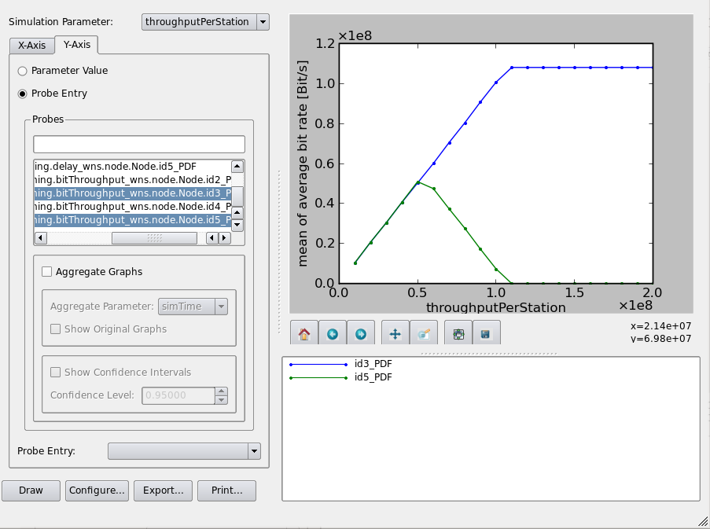
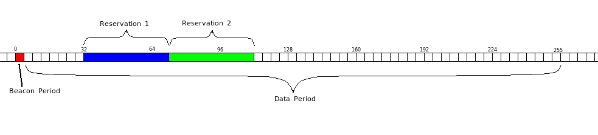
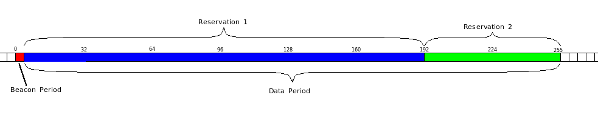
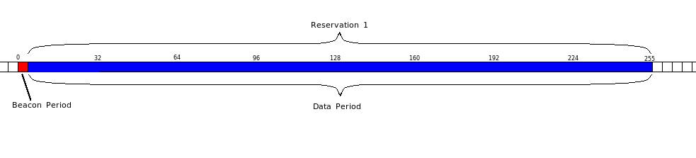
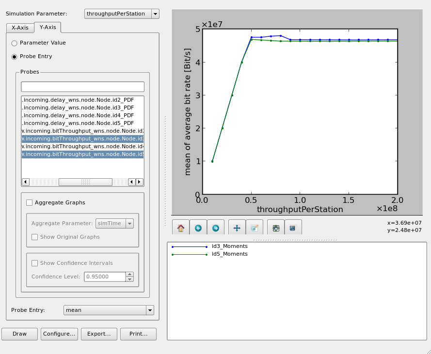

################################
Experiment 5: Relinquish Request
################################

This experiment brings up the problem that a station cannot start a transmission if the system is already saturated.

.. note::

    The experiments 5 and 6 of this tutorial are only executable with the local version of the WiMeMAC module at the ComNets Research Group. The ``relinquish request`` feature is not available in the main branch of the module.
    

******
Part 1
******

At first, create a new subcampaign with ``experiment5`` as the folder name. Copy the ``config.py`` and the ``campaignconfiguration.py`` from experiment 2 into this folder.

The new scenario is similar to the one from the previous experiment. It consists of 4 stations arranged like this:

At the beginning of this experiment station 1 initializes a transmission to station 2. After one second, station 3 starts another transmission to station 4. We will evaluate the success of these transmissions by displaying the data throughput.

Editing config.py
-----------------

Adapt the ``config.py`` to our new scenario: Enter the value for ``numberOfStations``, arrange the stations as shown in the picture and make sure that a transmission from 1 to 2 starts at 0.01 seconds of simulation time and another one from 3 to 4 starts at 1.01 seconds. Again, if you have any problems configuring the file or if the simulation results are not as they should be, you can find an applicable copy of the configuration files at

.. code-block:: bash

    $ cp ../../myOpenWNS/tests/system/wimemac-addOn-Tests--main--1.0/PyConfig/experiment5/config.py .
    $ cp ../../myOpenWNS/tests/system/wimemac-addOn-Tests--main--1.0/PyConfig/experiment5/campaignConfiguration.py .

Evaluating the results
----------------------

Create the database as well as the scenarios and start the simulation. Afterwards display the throughput in the Wrowser. In the probe list, select the ``traffic.endToEnd.window.incoming.bitThroughput_wns.node.Node.id_X_PDF`` probes of both receiving stations. The IDs of the two receiving stations are in this case the highest ID available and the third highest ID.

As we can see, the transmissions went well unless the offered traffic is higher than 50 Mb/s. Beyond this point, station 2 receives still all frames up to the saturation point of the connection, but the more traffic station 1 produches for station 2, the less traffic is station 3 able to handle. This effect occurs because the order in which the transmissions are started is important. For small values of ``throughputPerStation`` the superframes look like this:

But bigger values lead to superframes like this:

Since the connection to station 2 is established first, it can take all the space of the superframe it needs to transmit all of its frames. When the second connection creates a reservation, it can only take the few MASs that are still free. The more MASs the first connection needs, the less MASs can be used by the second connection.

This means if one station offers a lot of load per second, all other connections are blocked. The solution to this problem will be presented in the second part of this experiment.

******
Part 2
******

Connections for other stations in a full superframe are possible with a so called `relinquish request`. A relinquish request is sent by a station that initiates a new transmission but can't reservate all the MASs it needs for this transmission. When such a request reaches the stations that are already having active connections, they will adapt their reservation patterns so that another station can also establish a connection. For example, if a station receives a relinquish request and it knows from the previous beacon period that there are already two active transmissions running, it will adapt its own reservation pattern so that it allocates at most 1/3 of the superframe. With this step, a third connection can be established and every station can continue or initiate a transmission.

To activate the relinquish request, open the ``config.py`` file of your simulation, look for the line 

.. code-block:: python

   useRelinquishRequest = False

and set its value to ``True``. Run the simulation again afterwards. Since you didn't change the ``campaignconfiguration.py``, you don't need to create the database or the scenarios. Scenarios that have the state ``Finished`` instead of ``NotQueued`` can be started with the command

.. code-block:: bash

   $ ./simcontrol --execute-locally --restrict-state=Finished

Display the campaign results again with the Wrowser. They should look like this:

This time, both connections could be established. The saturation point of the first connection is lower than in the previous simulation, because it has to share the superframe with the second connection.
When the simulation begins, the first reservation is created with all the MASs it needs to transmit the data. When the second reservation is about to be created after 1 second of simulation time, station 1 shortens its pattern for the first transmission so that it only uses 1/2 of the superframe. This way, the transmission to station 4 can also be created and both transmissions run parallel.

.. note::

    The second connection has a slightly smaller throughput if the saturation point is reached. This effect occurs because of the segmentation of the superframe: Since the beacon period takes up 3 MASs in this experiment, the remaining 253 MASs can't be divided equally among the stations. Station 1 has one more MAS reserved than station 3.

The next experiment will be the biggest and last experiment of this tutorial.
