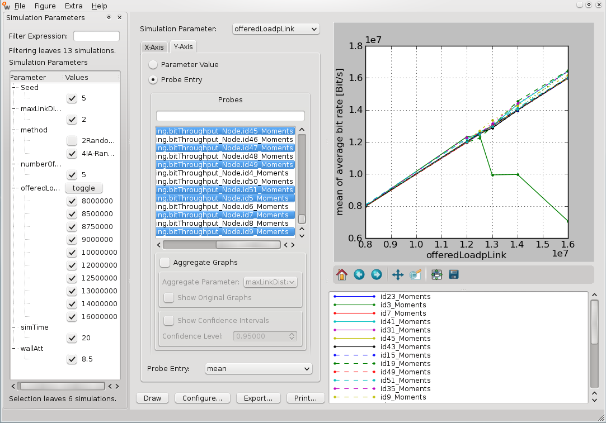

####################################
Experiment 6: Interference Awareness
####################################

This experiment will show one method to handle interference between transmissions.

*****************
Signal Modulation
*****************

------------
Interference
------------

.. figure:: images/experiment6-obstacle.png
   :align: center

Under certain circumstances, the signals between 2 stations are attenuated so much that they aren't aware of each others existence; the stations may use the same slots in the superframe and both connections can be established if they are separated. But the signals may still be strong enough to cause interference during the data transmission. This leads to transmission errors, compounds will have to be sent again and the data troughput will decrease.
To minimize the throughput loss, the WiMeMAC module has a parameter ``interferenceAwareness`` in its config file. With this parameter set to ``True``, every transmission target will report the packet error rate (PER) to the corresponding transmission owner. If the PER exceeds a certain level, the owner will make the transmission less interference-prone by changing the modulation coding scheme (MCS).

------------------------
Modulation Coding Scheme
------------------------

The modulation coding schene (MCS) is the way the frequencies are modulated to transmit the data bits. Every station can switch between several MCSs to adapt the transmission to the current situation. If there is not much interference, the transmitting station will choose a MCS that may be susceptible to noise or interference but offers a higher data rate. In case of a higher PER due to more interference, most of the compounds would have to be sent two or three times. To prevent that, the station changes to a different MCS that makes the signal less error-prone in exchange for a lower data rate. Although the data rate is lowered, the throughput will increase because of the improved signal stability. By using the ``interferenceAwareness`` function, every station will adapt its MCS to the current situation to maximize the data troughput.

************
The Scenario
************

This scenario is bigger than every other scenario of this tutorial so far. It was part of a diploma thesis and utilizes most of the capabilities of the WiMeMAC module. It consists of 50 stations that are arranged in an alignment of several walls. This is the scenario setup:

In this setup, we have 5 seperated rooms, arranged as a cross. In each room are 10 stations; 5 transmission owners and their corresponding targets. The rooms have a size of 6x6 meters. Every station keeps at least 1 meter distance to each wall.

.. note::

    The walls in this experiment differ from the wall we had in experiment 4. That wall had an exaggerated strong signal attenuation to show the hidden node problem. The walls we have here are more realistic, have a weaker attenuation and don't absorb the signal completely.

All the stations in one room can communicate freely with each other and are aware of the existing connections in their room. The signals from stations in other rooms are attenuated because of the walls; they are so alleviated that the stations in the center room are not aware of the existence of the stations in other rooms, but they are still strong enough to cause interference in the transmissions. We expect all the transmissions in this experiment to be slightly defective and we will compare the saturation points of the connections with and without the interferenceAwareness feature.

------------
Config Files
------------

Ok, here we go: Create a config.py with 50 stations, all the walls and arrange them as shown in the picture above.  
.............................just kidding, simply create a new subcampaign and copy the fully prepared config files to your subcampaign directory. The config files are stored in 

.. code-block:: bash

    $ cp ../../myOpenWNS/tests/system/wimemac-Tests--main--1.0/PyConfig/experiment6/config.py .
    $ cp ../../myOpenWNS/tests/system/wimemac-Tests--main--1.0/PyConfig/experiment6/campaignConfiguration.py .

Now take a look at the config.py. In this file, each room is referred to as a wpan. Scroll to the parenthesis where normally the stations are placed into the scenario environment. As you can see, this time the placement is a little more complicated: The position of each node is random; it is only subject to some restrictions: Each wpan contains 5 senders and 5 receivers, each node keeps at least 1 meter distance to all walls and there mustn't be two stations at the same position.

.. note::

    Altough the station placement is random, the experiment results are still reproducable. The ``config.py`` uses a special random number generator that requires a number as an input value. It generates an arbitrary amount of random numbers from the input value, and if you start the experiment again with the same input value, the same sequence of numbers will be generated.

-------------
Binary Search
-------------

To determine the saturation point of a connection, we have simply set up a row of simulations and looked in the wrowser where not all the offered load could be transmitted. Now that we have 25 connections, this procedure would be too time consuming, so we use a more efficient way to determine the saturation point: The binary search.
The binary search creates dynamically scenarios during the campaign with traffic-values depending on the results of the previous scenario. It is used to estimate the maximum throughput of a connection with few scenarios. With this method, the first generated scenario will have a very low value for ''throughputPerStation'', like 8 Mb/s. If all the offered load could be transferred, the saturation point for this connection was not reached in this scenario; binary search generates another scenario and doubles the offered traffic. As long as the saturation point is not reached, the throughput will always be doubled. If the data throughput is below the offered load, the next scenario's traffic will have the arithmetic mean value between the last below-saturation-scenario and the last executed scenario. If the last executed scenario was a below-saturation-scenario, the mean value will be calculated with this scenario and the last over-saturation-scenario.
To make this procedure more understandable, let's look at the example in the picture:

The binary search uses 7 scenarios to estimate the saturation point. After the 7th scenario, the alteration of the value for ''throughputPerStation'' would be very small and lies below the abortion-threshold. So the binary search ends after this scenario and declares the 7th measurement point as the saturation point.

-----------------------
Starting The Experiment
-----------------------

Since this experiment is a lot different from our other experiment (automatic generation of further scenarios, etc.), we don't start with the 'create-database create-scenarios' routine. This time, switch to your campaign folder and type

.. code-block:: bash

   $ ./simcontrol.py --create-database --interval=2000

This will start the campaign. It consists of 2 separate simulations: The scenario will be executed once with the interference awareness feature and once without. The suffix ``interval=2000`` causes that after 2000 seconds the 2 scenarios will be ran again, this time with different values for ``throughputPerStation``, according to the next step in the binary search. When the saturation point for all the connections is determined, there will no further scenarios be generated. 

.. note::

    Even if all the saturation points are determined, the program will continue to check the results of the last cycle; to end the program, press ``Ctrl + C``.

Since it might take 6 or 7 cycles with the binary search to determine the saturation point, and one cycle takes 2000 seconds, this campaign will take a few hours to finish. After the saturation points have been determined, we can display the results with the wrowser. 

***********
The Results
***********

Start the wrowser and select your experiment. This time, we will display two separate diagrams: The first will show the throughput of all 25 transmissions without the interference awareness feature, the second one show the same transmissions with this feature. 

At first, uncheck the checkbox next to ``4IA-Random-MAS`` since the graphs that belong to this option will be displayed in the second diagram. Then, select ``Figure-> New-> Parameter``, choose ``offeredLoadpLink`` as the simulation parameter and then select ``traffic.endToEnd.window.incoming.bitThroughput`` for all stations with an odd index. The results should look like this:

.. figure:: images/experiment6-Wrowser_resultsNoIA.png
   :align: center

.. note::

    In this scenario, the odd indexes represent the receiving node of each connection. Since we measure the incoming throughput, it would make no sense to include the even indexes who have only outgoing data.

The most conspicuous aspect of these results is that some stations reach a lower throughput despite a higher offered load. The reason for this is that the ``useRelinquishRequest`` parameter in this configuration is set to false. Stations that start to transmit earlier reserve more slots if there is more offered load, so other stations have less free slots to set up their own reservations. This effect starts at a throughput of 12.5 Mbit per link. Since some stations are suppressed at higher values for ``offeredLoadpLink``, this is the saturation point for this scenario. The maximum throughput for the whole system (25 connections) is 25*12.5 Mbit = 312.5 Mbit.

Now let's see how the scenario went with interference aware scheduling. Check the checkbox next to ``2Random-MAS`` and uncheck ``4IA-Random-MAS``. Draw the results .

At first appearance, these results look similar to the previous. But if you look closer, it is noticable that no station is suppressed before 13.5 Mbit throughput per link. That means, the complete system throughput is 337.5 Mbit. 

As you can see, the ``interferenceAwareness`` feature increased the maximum throughput by 25 Mbit. 

**********
Conclusion
**********

Most of the functions of the module have been explained as well as the basic knowledge of the WiMedia standard. The intention of this tutorial is to provide an easy introduction to be able to work with the module after a short time. This experiment is the last one of this tutorial and concludes the introduction to the WiMeMAC module. 