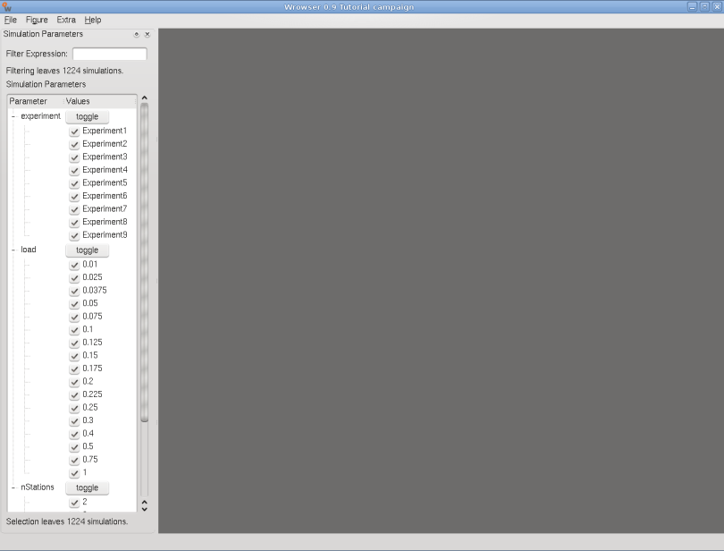
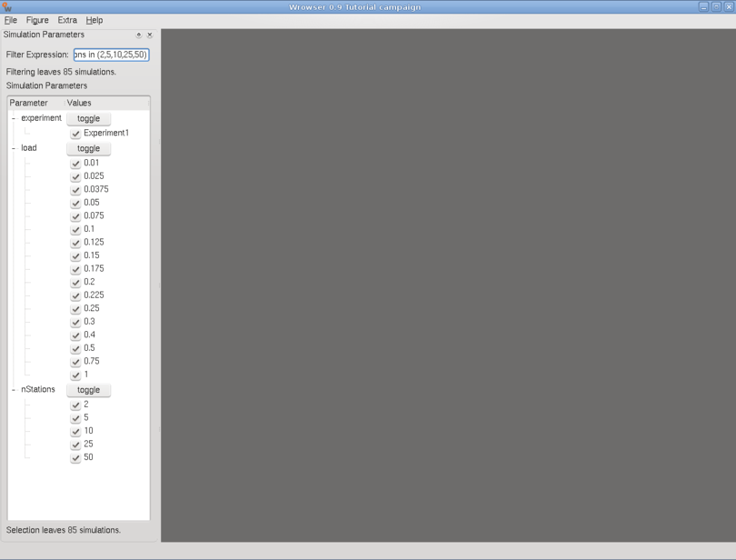
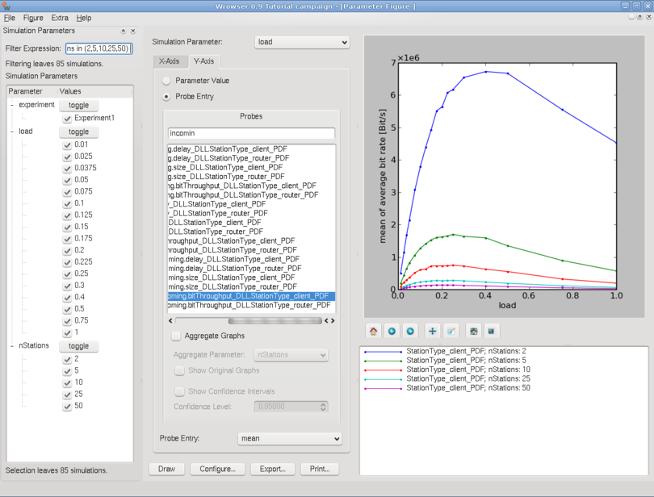
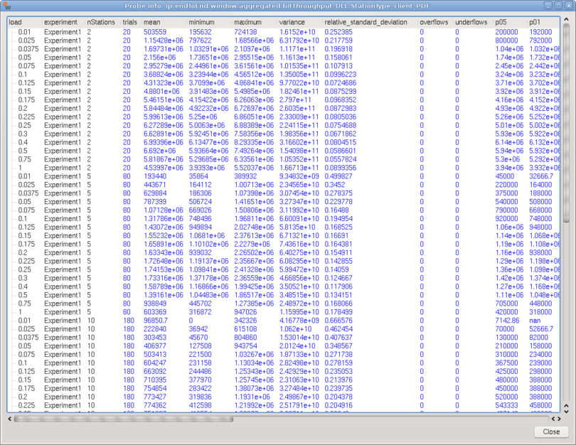
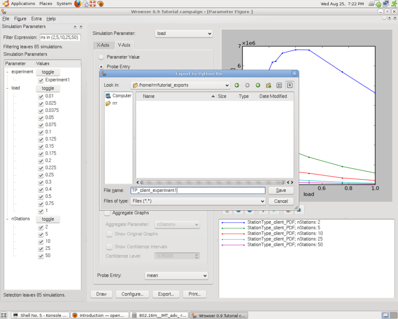
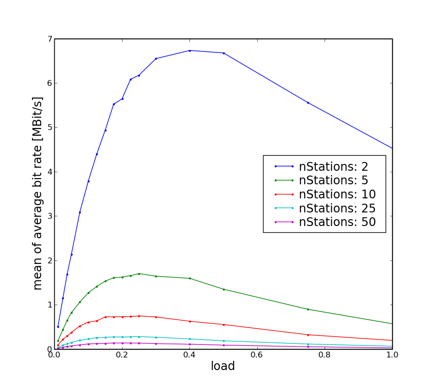

=========================
Using the openWNS Wrowser
=========================

The Wrowser (an acronym for Wireless network simulator Result brOWSER)
supports with a graphical interface the collection of results,
extraction of measurements and creation of parameter
plots. Furthermore, the Wrowser helps to create simulation campaigns
with large parameter spaces. The Wrowser is a project separated from
the openWNS and thus has to be installed independently.

The steps to install the Wrowser are described in the chapter
:ref:`gettingStarted`.

After installing the Wrowser you should now be able to start the Wrowser using

.. code-block:: bash

   $ wrowser

In the empty Wrowser window, you can go on and open a simulation campaign in the Wrowser by selecting *Open Campaign Database* in the File menu.
The Wrowser now displays a dialog, with the list of all simulation campaign that are stored in the database, grouped by the usernames, see :ref:`figure-wrowser-selectCampaign`.

.. _figure-wrowser-selectCampaign:

.. figure:: images/Campaigns_rrr.*
   :width: 380px
   :align: center

   Campaign selection

After reading in the simulation parameters from the database, the
Wrowser will display all possible parameter combinations, see
:ref:`figure-wrowser-simparameters`.

.. _figure-wrowser-simparameters:

   Parameter selection

We only want to plot some results for Experiment1. We can deselect all other experiments manually, by using the according toggle button or by entering a *Filter Expression*. Since the first two options are trivial we demonstrate the usage of filter expressions. Using the mighty filter expressions we also narrow down the available combinations for the *nStations* parameter.

.. code-block:: python

   experiment=="Experiment1" and nStations in (2,5,10,25,50)

Now only our selected parameter combinations are shown in the left side of the Wrowser window, see :ref:`figure-wrowser-simparameters-filtered`.

.. _figure-wrowser-simparameters-filtered:

   Parameter selection filtered

As filter expression any valid python expression can be entered.

We want to plot some throughput graphs. The adequate figure type for this purpose is called "Parameter Plot". Hence, we select Figure -> New -> Parameter. In the new window, we pick *load* as our simulation parameter. The simulation parameter will be displayed in the x-axis. For the y-axis, we select a throughput probe and click draw.

If we had simulated more than one drop we could aggregate our simulation results over the drop parameter by selecting the according aggregate parameter and also plot confidence intervals.

By right-clicking on a probe we also can select *Probe Info* to see all available information about that probe, see :ref:`figure-wrowser-probeinfo`.

.. _figure-wrowser-probeinfo:

   Probe info window

In the probe info window, you can right-click again on a selected simulation (one row) to display the stdout and stderr files of the simulation.

Now we want to export the plot to use it for a presentation. The Wrowser allows to export a plot as csv, as matlab file or as a python script.
In the following the third option is described. Contrary to the first two options it does not write out the simulation data in a file, but it generates a python script that retrieves the data from the database in order to plot it. The python script offers a huge set of configuration possibilities, for scaling the plot, modifying the legend, the axis labels, ... .
The big advantage of using the python export is that if you have to simulate again, you do not need to export your data again and modify the settings of the plot, as you would need to do with the matlab file. The only thing the user has to do is to execute the python script again. If you have exported several plots, you can go to your export directory and execute plotAll.py to process all exports again.

Ok, let us now export the plot as python script. As filename we choose TP_client_experiment1.

In the terminal we can start the generated export file.

.. code-block:: bash

   $ ./TP_client_experiment1.py

The script creates a directory named *figures* , and stores the plots there.

.. code-block:: bash

   $ gv figures/TP_client_experiment1.pdf

In the generated python script, the user finds almost no code, but a lot of configuration options. Most of these are already set according to your settings in the Wrowser. In the following the most important configuration options are shown.

The axis labels can be set as shown here.

.. code-block:: python

   xLabel = 'load' #label of the x axis
   yLabel = 'mean of average bit rate [Bit/s]' #label of the y axis

The values can be scaled with:

.. code-block:: python

   scaleFactorX = 1 #1/1e6 #bit to MBit
   scaleFactorY = 1 #1/1e6 #bit to MBit

The settings for the scalefactors also affect the viewport. For the viewport min and max values can be set for each axis. These values only have an impact if the doClip option is set to True. With the last two parameters the figure can be moved.

.. code-block:: python

  doClip = True
  minX = 0.0 * scaleFactorX 
  maxX = 1.0 * scaleFactorX 
  minY = 0.0 * scaleFactorY 
  maxY = 7000000.0 * scaleFactorY 
  moveX = 0
  moveY = 0
 
The legend position, titles and the order of the legend entries can be configured with the following parameters:

.. code-block:: python

  legend = True
  legendPosition = 'best' #alternatives: upper right, upper left, ... or (x,y) with x,y in [0-1]
  legendLabelMapping = {
    "traffic.endToEnd.window.incoming.bitThroughput; nStations: 2" : "nStations: 2" , #graph 0
    "traffic.endToEnd.window.incoming.bitThroughput; nStations: 5" : "nStations: 5" , #graph 1
    "traffic.endToEnd.window.incoming.bitThroughput; nStations: 10" : "nStations: 10" , #graph 2
    "traffic.endToEnd.window.incoming.bitThroughput; nStations: 25" : "nStations: 25" , #graph 3
    "traffic.endToEnd.window.incoming.bitThroughput; nStations: 50" : "nStations: 50" , #graph 4
  }
  plotOrder = [0, 1, 2, 3, 4] #means: first graph 0, then graph 1, ...

Aggregation of the graphs and the plotting options for confidence intervals are set as shown here:

.. code-block:: python

  aggregate = False  #aggregate graphs over the aggrregation parameter
  aggrParam = '' #the aggregation parameter
  confidence = False #plot confidence intervals?
  confidenceLevel = 0.95 #the confidence level
  originalPlots = False #plot the original plots?
  
Color and style options are set with the following parameters:

.. code-block:: python

  color = True 
  color_styles = ['b-', 'g-', 'r-', 'c-', 'm-'] #matlab notation (b- : blue solid line)
  bw_markers = ['+','.','*','x','o','v','^','<'] #markers for black and white plots
 
A figure title can also be configured:

.. code-block:: python

  showTitle = False
  figureTitle = 'Parameter Figure '

Additional plots are defined as done here:

.. code-block:: python

  additional_plots = [
    #{'x': [1,400], 'y':[200,200], 'label':'a horizontal line' , 'style':'b--'},
    #{'x': [1,400], 'y':[1*.98,400*0.98], 'label':'98 % line' , 'style':'g--'}
  ]

The export filename and the outputFormats are specified like this:

.. code-block:: python

  fileName = 'TP_client_experiment1'
  outputFormats = [ 'png', 'pdf']

A grid can be defined with:

.. code-block:: python

  grid = (False, False, False, False)

The order of the grid parameters is xmajor, xminor, ymajor, yminor

The scale of the axis can be set with:

.. code-block:: python

  scale = ('linear', None, 'linear', None)

The scale of an axis can be either 'linear' or 'log'. For 'linear' the second parameter is always None. For 'log' the second parameter defines the base of the logarithm. Again the first two parameters describe the x axis and the last two the y axis.

Examples of more advanced features like the definition of arrows and annotations are available in the export file.

